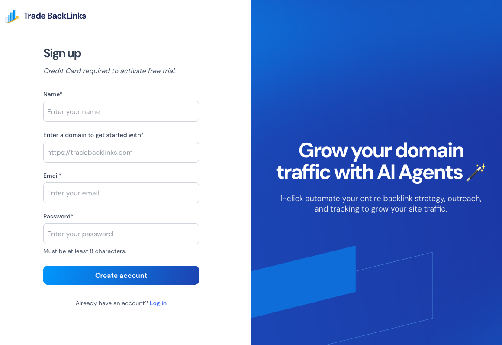
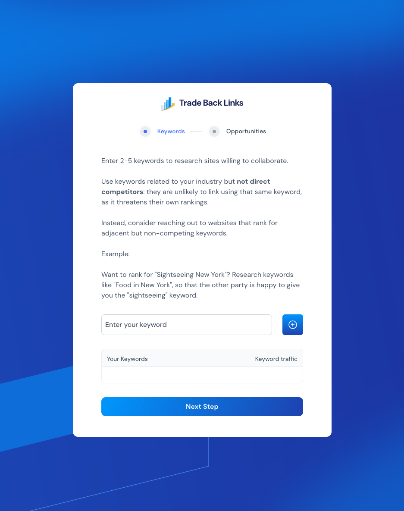
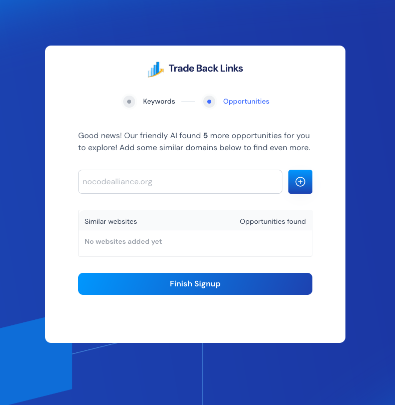
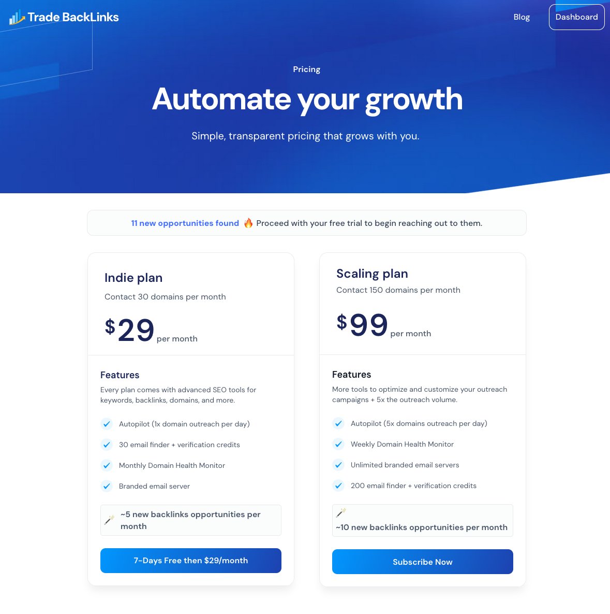
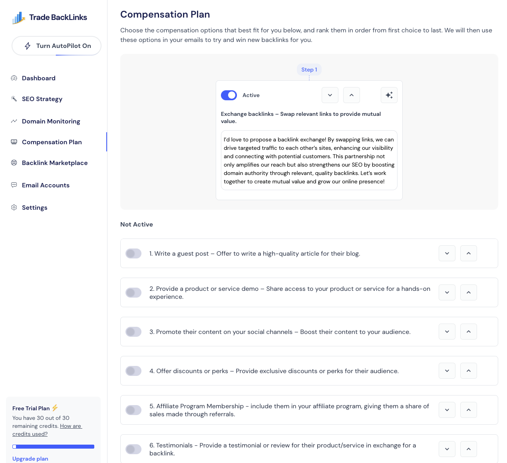
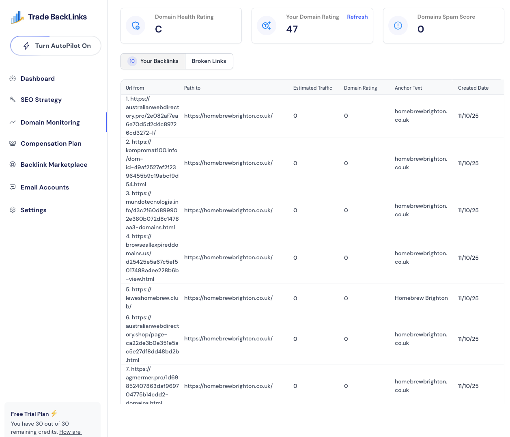

# Getting Started

Follow these steps to go from signup to your first Autopilot campaign.

## 1. Create your workspace

1. Visit [tradebacklinks.com](https://www.tradebacklinks.com) and start the free trial.
2. Confirm your email address.
3. Provide your primary domain and company name so the system can personalize outreach copy.

## 2. Seed keywords and competitors

1. Enter the keywords you want to rank for (e.g., `no code developers`).
2. Add 2–3 similar but not closely competing domains. TradeBacklinks uses this to source matching opportunities.
3. Wait a few minutes while opportunities are fetched in the background.

## 3. Choose a plan & Autopilot pace

1. Review the estimated backlinks per month for each plan.
2. Select how many domains per day Autopilot should contact (1–5). You can change this later.

## 4. Configure compensation settings

1. Open **Compensation Plan**.
2. Toggle on the offers you’re comfortable with (swaps, guest posts, product demos, etc.).
3. Reorder them so Autopilot leads with your preferred incentive.

[Learn More](dashboard/compensation-plan.md)

## 5. Connect your sending domain

1. Head to **Email Accounts** and follow the DNS instructions.
2. Add at least one inbox per domain once DNS verifies.
3. Monitor the summary cards (sent emails, replies, spam complaints) to ensure deliverability.

[Learn More](dashboard/email-accounts.md)

## 6. Turn on Autopilot

1. Review the Opportunity list under **SEO Strategy**.
2. Toggle Autopilot on. The system will queue daily outreach based on scoring and your compensation rules.
3. Track progress from the dashboard and pause Autopilot anytime.

[Learn More](dashboard/seo-strategy.md)

Next: review each [dashboard](dashboard.md) module for more context.
