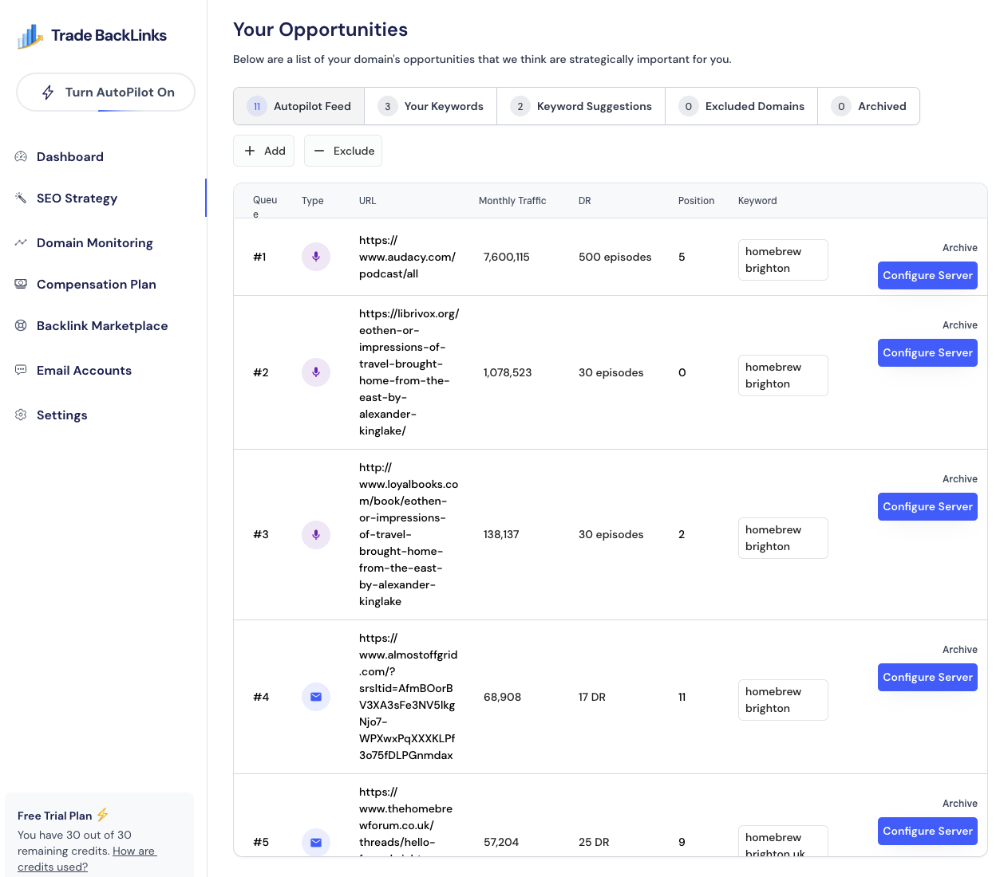

# SEO Strategy

The SEO Strategy tab is where you review and curate backlink opportunities.

## Opportunities table
- **Queue number** – Autopilot order. #1 is the next domain scheduled for outreach.
- **Type** – Podcast, blog, directory, etc. Helps you balance your backlink mix.
- **URL** – The exact page we suggest contacting.
- **Monthly traffic** – Approximate visits. Use it to prioritize referral potential.
- **DR** – Domain authority score.
- **Position & Keyword** – Where your competitor ranks and which keyword this opportunity supports.

## Tabs
1. **Autopilot Feed** – AI-ranked list ready for automated outreach.
2. **Your Keywords** – Opportunities tied directly to the keywords you entered.
3. **Keyword Suggestions** – Additional phrases TradeBacklinks discovered during research.
4. **Excluded Domains** – Domains you’ve archived or paused.
5. **Archived** – Historical record of opportunities you’ve closed out.

## Actions
- **Add** – Manually add a domain (for referrals, events, or personal relationships).
- **Exclude** – Hide a domain from Autopilot if it’s off-brand.
- **Archive** – Move completed or irrelevant opportunities out of the queue.
- **Configure Server** – Shortcut to email domain setup when a queued domain requires a dedicated sender.

Tips: Review the table weekly to fine-tune priorities. Promote manually added domains to the top of the queue if you have a warm intro.
